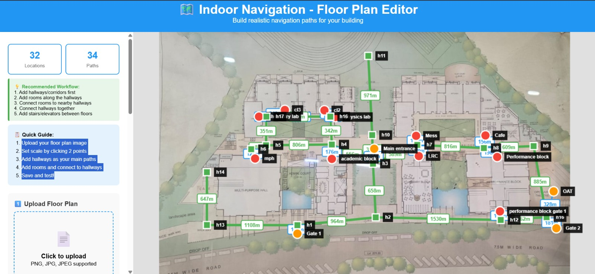
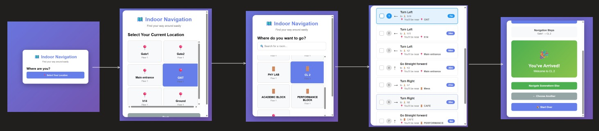
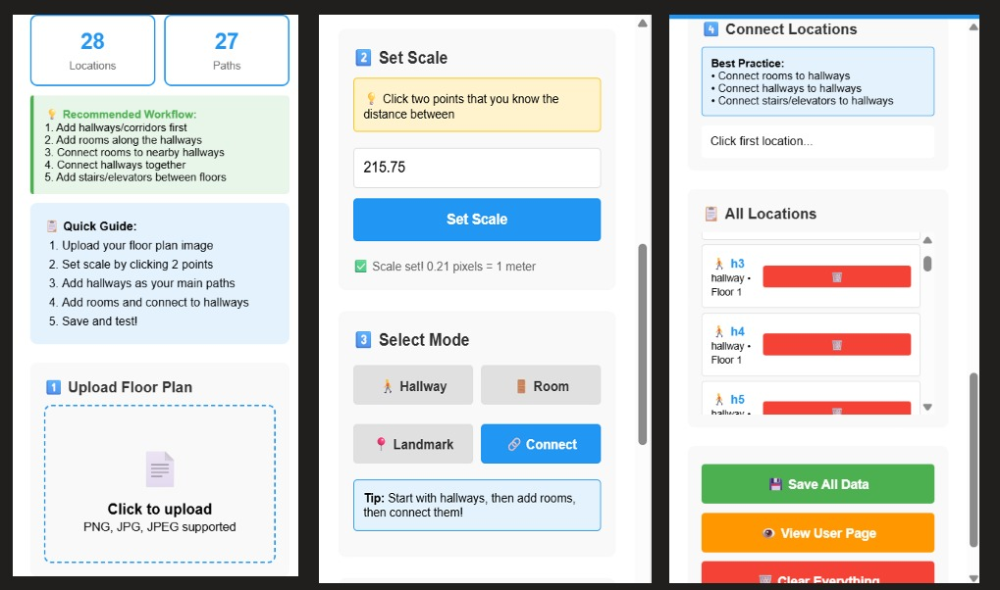
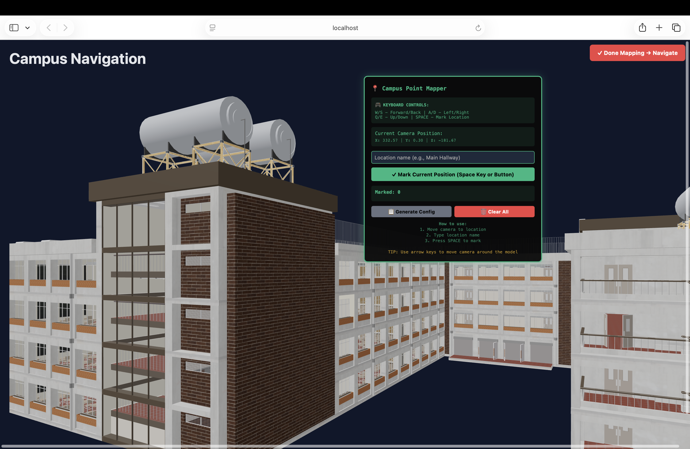
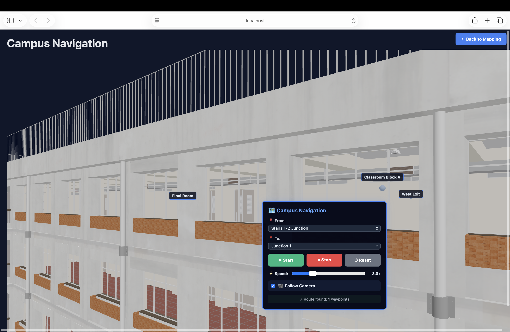

# Indoor_mapping
# Indoor Navigation System (2D + 3D)

This project is an **Indoor Navigation System** that enables users to navigate inside buildings using **2D floor plans** and an extended **3D model** for better visualization.

The system provides **step-by-step, human-readable navigation instructions** such as:
- Move straight
- Turn left
- Turn right  
along with **landmark-based guidance** like *“You are near X”*.

---

## 🔹 2D Model Overview

The 2D model converts a building’s floor blueprint into a navigable map by defining **paths, rooms, and landmarks**.

### ✨ Key Features
- Upload floor plan / blueprint image  
- Set real-world scale using reference points  
- Add hallways as main navigable paths  
- Support for intersections (straight paths, T-junctions, crossroads)  
- Add rooms and landmarks  
- Select current location and destination  
- Generate personalized navigation instructions  

---

## 🧭 2D Navigation Workflow

### Step 1: Upload Floor Plan
Upload the building’s floor blueprint image to begin mapping.

---

### Step 2: Set Scale
Select **two points** on the floor plan whose real-world distance is known.  
This allows accurate distance calculation during navigation.

---

### Step 3: Create Paths, Rooms & Landmarks
- Add hallways as the primary navigation paths  
- Define intersections (tiraha, chaura, straight corridors)  
- Add rooms as destinations  
- Add landmarks for orientation and current location  

---

### Step 4: Save & Navigate
- Save all mapped data  
- Select your **current location** (landmark)  
- Choose your **destination** (room or landmark)  

The system generates instructions such as:
- You are near **X**
- Move straight
- Turn right
- Turn left

---

## 🧠 2D Navigation Output

The navigation output is:
- **Personalized**
- **Easy to understand**
- **Landmark-based**
- **Distance-aware** using real-world scale

---

## 🔹 3D Model Overview

The 3D model extends the indoor navigation system into a **3D environment**, providing better spatial understanding and visualization while following the same navigation logic as the 2D model.

### ✨ Key Features
- 3D visualization of indoor spaces  
- Interactive building navigation  
- Room and landmark-based routing  
- Clear directional guidance in a 3D environment  
- Improved user orientation and immersion  

---

## 🧭 3D Navigation Flow

1. Load the 3D building model  
2. Select current location  
3. Choose destination (room or landmark)  
4. Follow navigation instructions inside the 3D space  

---

## 🖼️ 3D Model Screenshots

  

---

## 🎥 3D Model Demo
🔗 [Watch Demo Video](https://drive.google.com/file/d/1dFeZXzHmwk0W4QpfH-j6pogvdhWAISAn/view?usp=sharing)

---

## 📦 3D Model Repository
🔗 [3D Model GitHub Repository](https://github.com/AbhijeetSirohi/Innovate_3.0_3d.git)

---

## 🚀 Future Enhancements
- Real-time indoor positioning  
- Multi-floor navigation  
- Voice-based navigation assistance  
- Accessibility-friendly routing  

---

## 📌 Summary

This project delivers a complete **indoor navigation solution**, starting from a **2D floor blueprint** and extending into an interactive **3D navigation model**, making indoor movement intuitive, accurate, and user-friendly.
